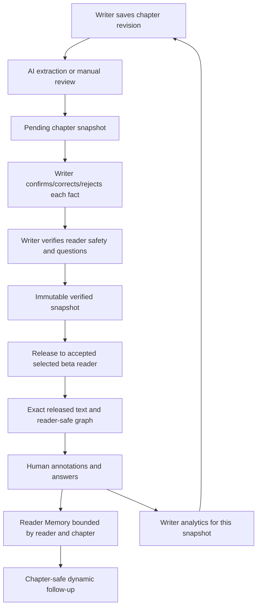

# Storylens architecture

## Application boundaries

`frontend/app/` contains the Next.js client UI, strongly typed API client, editable
Story Universe, writer screens, and private reading/interview experience.

`backend/app/` separates SQLAlchemy storage (`db.py`), input/output schema contracts
(`schemas.py`), authentication (`security.py`), structured AI and safe projection
(`analysis.py`), explicitly labeled sample content (`sample.py`), and authorized
application endpoints (`main.py`).

## Workflow

## Relational model

| Table | Purpose / ownership |
|---|---|
| users | Identity, password hash, fixed account role, optional reader preference |
| sessions | Hashed opaque token, user, expiry |
| stories | Writer-owned title, genre, description |
| chapters | Ordered mutable chapter, content, revision, private intent |
| snapshots | Exact revision/title/content/intent/universe, verification state |
| invitations | Writer-selected email per story; pending/accepted/declined/revoked |
| releases | Reader + chapter + immutable snapshot; active flag and read completion |
| questions | Approved or dynamic question bound to the reader's release |
| answers | Immutable question answer, confidence, emotion, tension, timestamp |
| feedback | Exact released-text anchor, structured category, human comment |
| audit_events | Writer mutations and verification/release/revocation events |
| reader_memory_vectors | Optional future scoped embedding index; not yet populated |

`Universe` is strict structured JSON containing typed entities (characters,
relationships, events, locations, objects, secrets, clues, reveals, plot threads),
links, evidence, confidence, verification decisions, and reader visibility.
Character knowledge has state (knows / does_not_know / believes / feels), evidence,
and its own visibility. Writer-facing data and reader projections are distinct.

## Spoiler threat model

The server enforces access, not just navigation. Guessed chapter IDs, release IDs,
question IDs, and memory paths do not bypass ownership. Reader routes never return
unreleased manuscript revisions or author intent. A safe graph is generated from
the release's immutable snapshot, never from a story's newest state.

The reader AI's data boundary is its serialized input. It cannot receive private
canon and merely be instructed to conceal it. Existing reader-supplied theories
are treated as theories, not as verified story facts. Earlier chapter interviews
cannot retrieve later reader answers.

Limits still matter: a writer may deliberately mark a spoiler safe, a model may
phrase a poor question, or a reader may already know a twist outside the app.
Human review plus tests constrains these risks; the product does not claim that
LLM outputs can guarantee semantic spoiler safety without evaluation.

## Deployment

Next.js builds a static client, copied into a Python container and served from the
same origin as `/api`. PostgreSQL stores durable application state; pgvector is
available for a later retrieval increment. The local demo uses SQLite only to make
the workflow runnable without provisioning services. Production startup must never
enable demo accounts. TLS termination, backups, secrets, durable jobs, shared rate
limits, and schema migrations belong in the deployment configuration.
